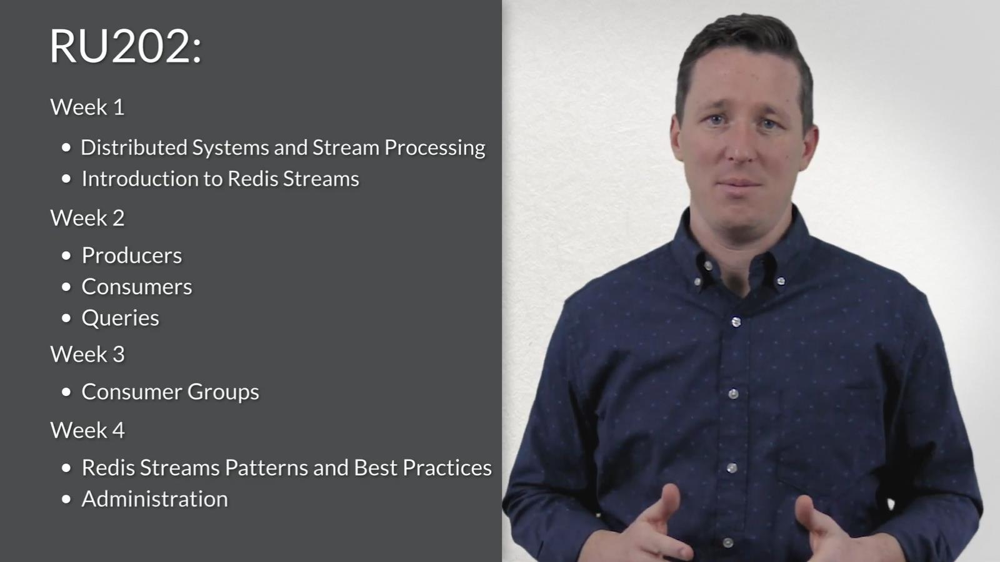

### RU202 - Redis Streams

[](https://youtu.be/DEH2VVnpP5E)

[RU202 course GitHub repository](https://github.com/redislabs-training/ru202.git)


### Prologue 
To perceive every single system as *distributed* system, to transmorph data processing into line stream processing... What will then be to system design, what will then be to the world... To begin with, [ACID](https://en.wikipedia.org/wiki/ACID) in monolithic RDBMS no longer viable but [CAP](https://en.wikipedia.org/wiki/CAP_theorem) plays an prominent role. 


#### I. [Week1: Redis stream introduction](https://university.redis.io/course/cjoybtwksjmsjz/submodule/rww3gqqfg3h3mg/)

1. [RU202 CH01 1 Introduction to Distributed Systems](https://youtu.be/L-G6ZfM4ASU)
2. [Quiz 1 | Redis streams introduction](https://university.redis.io/course/cjoybtwksjmsjz/submodule/qiodmbbmt9hzlq/)
3. [RU202 CH01 3 Stream Processing](https://youtu.be/mFfksRQH9Qk)
4. [RU202 CH01 4 Stream Pipelines V05](https://youtu.be/dkLqij4pr68)
5. [Quiz 2 | Redis streams introduction](https://university.redis.io/course/cjoybtwksjmsjz/submodule/xlptmvcp12pzhx/)
6. [RU202 CH02 1 Overview of Redis Streams V04](https://youtu.be/0a9Uvx5EyD4)
7. [Quiz 3 | Redis streams introduction](https://university.redis.io/course/cjoybtwksjmsjz/submodule/uhrmzciprpv636/)
8. [RU202 CH02 3 Comparison V07](https://youtu.be/k6k6Hfqqwz0)
9. [Quiz 4 | Redis streams introduction](https://university.redis.io/course/cjoybtwksjmsjz/submodule/xbppkyza2kcw29/)
10. [RU202 CH02 5 working example V03](https://youtu.be/LNJ8evEdENA)
11. [Quiz 5 | Redis streams introduction](https://university.redis.io/course/cjoybtwksjmsjz/submodule/mqw4sqa0l3kqbj/)
12. [Hands-on activity](https://university.redis.io/course/cjoybtwksjmsjz/submodule/7wn2zsht7lw0ar/)
13. [Quiz 6 | Redis streams introduction](https://university.redis.io/course/cjoybtwksjmsjz/submodule/ayhtxtgpp8r6pz/)
14. [RU202 CH02 7 Week 1 Recap](https://youtu.be/NUA00AaxOTk)


#### II. [Week2: Redis streams producers and consumers](https://university.redis.io/course/52wyuazvxg07ov/submodule/1ofzi2getjh3g6/)

1. [RU202 CH05 0 Introduction to Week 2 V02](https://youtu.be/3LM6tBFBz1U)
2. [RU202 CH05 1 What Stream Producer V03](https://youtu.be/eWjhwvJeP38)
3. [RU202 CH05 2 Producer API](https://youtu.be/-kkA_aSdIs4)
4. [RU202 CH05 3 Message Identifier](https://youtu.be/TtsRO1viT0Q)
5. [Quiz 1 | Redis streams producers and consumers](https://university.redis.io/course/52wyuazvxg07ov/submodule/jrhgeazjlbxytv/)
6. [RU202 CH05 5 Message Payload V04](https://youtu.be/FVjQ421eJ0U)
7. [Quiz 2 | Redis streams producers and consumers](https://university.redis.io/course/52wyuazvxg07ov/submodule/frchdi5eovfjq9/)
8. [Managing the length of a stream](https://youtu.be/VBBb8IkDE4s)
9. [Quiz 3 | Redis stream producers and consumers](https://university.redis.io/course/52wyuazvxg07ov/submodule/kmdlhalkx4cxl3/)
10. [RU202 CH06 1 Time-Based Range Queries](https://youtu.be/_558WNQneuU)
11. [Quiz 4 |Redis streams producers and consumers](https://university.redis.io/course/52wyuazvxg07ov/submodule/sbplnqltzxjihg/)
12. [RU202 CH06 3 Going back in time](https://youtu.be/615eJGdsVtA)
13. [Quiz 5 | Redis streams producers and consumers](https://university.redis.io/course/52wyuazvxg07ov/submodule/f4kh6i9uvvsz7o/)
14. [RU202 CH06 5 Reading a single message V02 1](https://youtu.be/sUoe2XxHp2U)
15. [Quiz 6 | Redis streams producers and consumers](https://university.redis.io/course/52wyuazvxg07ov/submodule/wqbcsqxvxqbj4t/)
16. [RU202 CH07 1 The Consumer](https://youtu.be/PoQT4TU6YhQ)
17. [Quiz 7 | Redis streams producers and](https://university.redis.io/course/52wyuazvxg07ov/submodule/huxnp2lqaevo0v/)
18. [RU202 CH07 3 The Blocking Consumer](https://youtu.be/3lqWdm4mv6U)
19. [Quiz 8 | Redis streams producers and consumers](https://university.redis.io/course/52wyuazvxg07ov/submodule/4eo1efgtctvqsh/)
20. [RU202 CH07 5 Concurrent Blocking Consumers V03](https://youtu.be/Isl-DE315vw)
21. [Quiz 9 | Redis streams producers and consumers](https://university.redis.io/course/52wyuazvxg07ov/submodule/ocdhyg0gqg31j7/)
22. [RU202 CH07 7 A Comparison to Pub Sub](https://youtu.be/gG0ZHE1JKNQ)
23. [Quiz 10 | Redis streams producers and consumers](https://university.redis.io/course/52wyuazvxg07ov/submodule/fw4ulvcnbhui55/)
24. [Quiz 11 | Redis streams producers and consumers](https://university.redis.io/course/52wyuazvxg07ov/submodule/wvubajmlxd0y4m/)
25. [RU202 CH07 9 Recap V02](https://youtu.be/Yh7oLbRzZIQ)


#### III. [Week3: Redis streams consumer groups](https://university.redis.io/course/0fm00sidql5ksq/submodule/hfuxvllprn4dg4/)

1. [RU202 CH08 0 Week 3 Overview V02](https://youtu.be/x3s0HDU7Unc)
2. [RU202 CH08 1 The Problem with Slow Consumers V04](https://youtu.be/K8Z0TmRMTl4)
3. [Quiz 1 | Redis streams consumer groups](https://university.redis.io/course/0fm00sidql5ksq/submodule/bn4u73uw7hesqu/)
4. [RU202 CH08 5 Consumer Groups V05](https://youtu.be/Npz_X6IYzCA)
5. [Quiz 2 | Redis streams consumer groups](https://university.redis.io/course/0fm00sidql5ksq/submodule/atxreiojsgkvwh/)
6. [RU202 CH08 7 Consumer in a group V04](https://youtu.be/l-ODi0KShco)
7. [Quiz 3| Redis streams consumer groups](https://university.redis.io/course/0fm00sidql5ksq/submodule/ajaykesp5hgjwk/)
8. [RU202 CH08 9 Processing in a Group V03](https://youtu.be/H4E5Eml-MIo)
9. [Quiz 4 | Redis streams consumer groups](https://university.redis.io/course/0fm00sidql5ksq/submodule/numy4ucx69dfbm/)
10. [RU202 CH08 11 Disabling Acks V03](https://youtu.be/QhrxqW6U_QA)
11. [Quiz 5 | Redis streams consumer groups](https://university.redis.io/course/0fm00sidql5ksq/submodule/qdwp31i2tz1f7b/)
12. [Hands-on activity: consumer groups](https://university.redis.io/course/0fm00sidql5ksq/submodule/po73y5ooqb3ead/)
13. [Running the code](https://university.redis.io/course/0fm00sidql5ksq/submodule/wzdcpukawty1st/)
14. [Redis CLI experiments](https://university.redis.io/course/0fm00sidql5ksq/submodule/ufkadhvo4gwmst/)
15. [Python code experiments](https://university.redis.io/course/0fm00sidql5ksq/submodule/4vpgy1l6ku3jlw/)
16. [Appendix: Code walkthrough](https://university.redis.io/course/0fm00sidql5ksq/submodule/e6ej1tlfpykz2u/)
17. [RU202 CH09 1 Basic consumer group admin V02](https://youtu.be/-0eXq_-BVQQ)
18. [XINFO GROUPs enhancements in Redis 7](https://university.redis.io/course/0fm00sidql5ksq/submodule/c520dqsoza82t5/)
19. [Quiz 6 | Redis streams consumer groups](https://university.redis.io/course/0fm00sidql5ksq/submodule/pghvvonanlqxfu/)
20. [Quiz 7 | Redis streams consumer groups](https://university.redis.io/course/0fm00sidql5ksq/submodule/uly1q4uqhpksgs/)
21. [RU202 CH09 3 Week 3 Recap](https://youtu.be/yvWsa5MfojM)


#### IV. [Week4: Redis streams in production](https://university.redis.io/course/1s4guyphj5wim8/submodule/i1kpcuofd6p9mc/)

1. [RU202 CH010 1 Week 4 Intro V02](https://youtu.be/Zz6_KZEQNhI)
2. [RU202 CH010 2 Understanding XPENDING and XCLAIM V04](https://youtu.be/qeER8DkuZro)
3. [Quiz 1 | Redis streams in production](https://university.redis.io/course/1s4guyphj5wim8/submodule/ugaokbzoa5zenl/)
4. [RU202 CH010 3 Consumer Recovery V03](https://youtu.be/BHoTtrcgNwA)
5. [Quiz 2 | Redis streams in production](https://university.redis.io/course/1s4guyphj5wim8/submodule/vzoxwx5s1iiu28/)
6. [The XAUTOCLAIM command](https://university.redis.io/course/1s4guyphj5wim8/submodule/mgilqjww4zdxj0/)
7. [RU202 CH010 5 Performance Considerations V02](https://youtu.be/FxTcR05gyAI)
8. [Quiz 3 | Redis streams in production](https://university.redis.io/course/1s4guyphj5wim8/submodule/7ridpeio42xmnq/)
9. [RU202 CH010 6 Stream Memory Management V03](https://youtu.be/Cjgayjghpgs)
10. [Quiz 4 | Redis streams in production](https://university.redis.io/course/1s4guyphj5wim8/submodule/y38lskyzthyatb/)
11. [RU202 CH010 7 Stream Capping Strategies V05](https://youtu.be/o3FihimOEjY)
12. [Quiz 5 | Redis streams in production](https://university.redis.io/course/1s4guyphj5wim8/submodule/gdrdecj5df4mnn/)
13. [RU202 CH010 9 Redis Streams Usage Patterns V02](https://youtu.be/tkt6imYE09o)
14. [Quiz 6 | Redis streams in production](https://university.redis.io/course/1s4guyphj5wim8/submodule/qbp0zuaf9dzgmp/)
15. [Hands-on activity: introduction](https://university.redis.io/course/1s4guyphj5wim8/submodule/s4k39zhclyqota/)
16. [Running the producer](https://university.redis.io/course/1s4guyphj5wim8/submodule/r2aa5fndb3eje0/)
17. [Inspecting the dataset](https://university.redis.io/course/1s4guyphj5wim8/submodule/aakjjmlytjjjbl/)
18. [Running the consumers](https://university.redis.io/course/1s4guyphj5wim8/submodule/yrmpphmzl5qiz8/)
19. [Recovering a crashed consumer](https://university.redis.io/course/1s4guyphj5wim8/submodule/tocr6mrtbhkstw/)
20. [The hourly averages stream](https://university.redis.io/course/1s4guyphj5wim8/submodule/vo6vd4neisebvb/)
21. [Quiz 7 | Redis streams in production](https://university.redis.io/course/1s4guyphj5wim8/submodule/chvvmxbekhwr4t/)
22. [RU202 CH010 12 Week 4 Recap V01](https://youtu.be/nh3-H_7Lx_M)


#### V. [Week5: Redis streams final exam](https://university.redis.io/course/m6hicyzbkqvosb/submodule/curb3uali4eetk/)


#### VI. Appendix 
1. [Introduction to Redis streams](https://redis.io/docs/latest/develop/data-types/streams/)

- Adding an entry to a stream is O(1). Accessing any single entry is O(n), where n is the length of the ID. Since stream IDs are typically short and of a fixed length, this effectively reduces to a constant time lookup. 

- If you're running Redis 7 or later, you can also provide an explicit ID consisting of the milliseconds part only. In this case, the sequence portion of the ID will be automatically generated. 
```
XADD race:usa 0-* racer Prickett
```

- In this way, it is possible to scale the message processing across different consumers, without single consumers having to process all the messages: each consumer will just get different messages to process. This is basically what [Kafka&#8482;](https://kafka.apache.org/) does with consumer groups. Reading messages via consumer groups is yet another interesting mode of reading from a Redis Stream.

- however note that streams are replicated with fully specified XADD commands, so the replicas will have identical IDs to the master. 

- To continue the iteration with the next two items, I have to pick the last ID returned, that is 1692632094485-0, and add the prefix ( to it. The resulting exclusive range interval, that is (1692632094485-0 in this case, can now be used as the new start argument for the next XRANGE call:

- Since XRANGE complexity is O(log(N)) to seek, and then O(M) to return M elements, with a small count the command has a logarithmic time complexity, which means that each step of the iteration is fast. So XRANGE is also the de facto streams iterator and does not require an XSCAN command.

- Apart from the fact that XREAD can access multiple streams at once, and that we are able to specify the last ID we own to just get newer messages, in this simple form the command is not doing something so different compared to XRANGE. However, the interesting part is that we can turn XREAD into a blocking command easily, by specifying the BLOCK argument. 

- the special ID $. This special ID means that XREAD should use as last ID the maximum ID already stored in the stream mystream, so that we will receive only new messages, starting from the time we started listening. This is similar to the tail -f Unix command in some way.

- A consumer group tracks all the messages that are currently pending, that is, messages that were delivered to some consumer of the consumer group, but are yet to be acknowledged as processed. Thanks to this feature, when accessing the message history of a stream, each consumer *will only see messages that were delivered to it*.

- as a side effect, claiming a message will reset its idle time and will increment its number of deliveries counter. 

- Claiming may also be implemented by a separate process: one that just checks the list of pending messages, and assigns idle messages to consumers that appear to be active. Active consumers can be obtained using one of the observability features of Redis streams. 

- When there are failures, it is normal that messages will be delivered multiple times, but eventually they usually get processed and acknowledged. However there might be a problem processing some specific message, because it is corrupted or crafted in a way that triggers a bug in the processing code. In such a case what happens is that consumers will continuously fail to process this particular message. Because we have the counter of the delivery attempts, we can use that counter to detect messages that for some reason are not processable. So once the deliveries counter reaches a given large number that you chose, it is probably wiser to put such messages in another stream and send a notification to the system administrator. This is basically the way that Redis Streams implements the *dead letter* concept.

- Messaging systems that lack observability are very hard to work with. 

- So basically Kafka partitions are more similar to using N different Redis keys, while Redis consumer groups are a server-side load balancing system of messages from a given stream to N different consumers.

- However trimming with MAXLEN can be expensive: streams are represented by macro nodes into a radix tree, in order to be very memory efficient. Altering the single macro node, consisting of a few tens of elements, is not optimal. 

- However in the current implementation, memory is not really reclaimed until a macro node is completely empty, so you should not abuse this feature.

- Streams, on the other hand, are allowed to stay at zero elements, both as a result of using a MAXLEN option with a count of zero (XADD and XTRIM commands), or because XDEL was called.

- The reason why such an asymmetry exists is because Streams may have associated consumer groups, and we do not want to lose the state that the consumer groups defined just because there are no longer any items in the stream. Currently the stream is not deleted even when it has no associated consumer groups.

- It should be enough to say that stream commands are at least as fast as sorted set commands when extracting ranges, and that XADD is very fast and can easily insert from half a million to one million items per second in an average machine if pipelining is used.

2. [Redis Streams Explained](https://youtu.be/Z8qcpXyMAiA)


### Epilogue

### EOF (2025/01/10)
